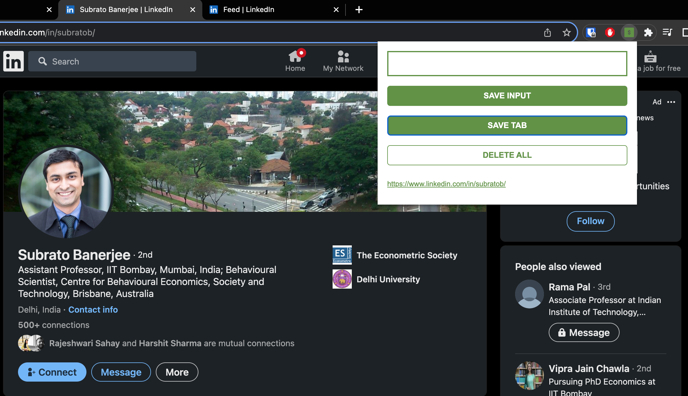
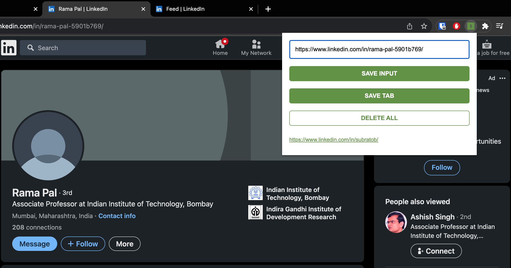
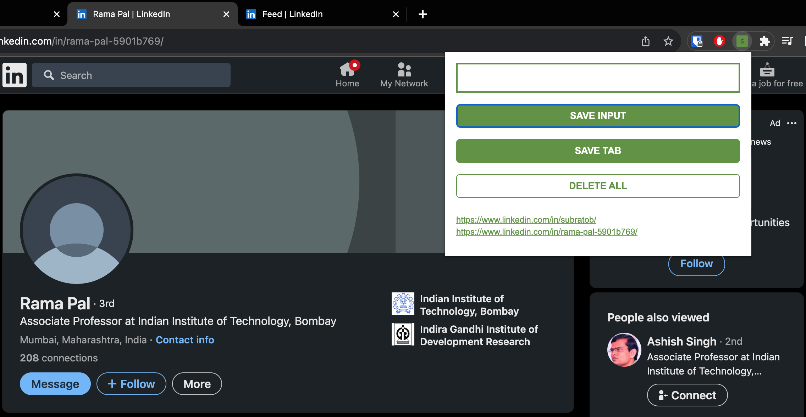
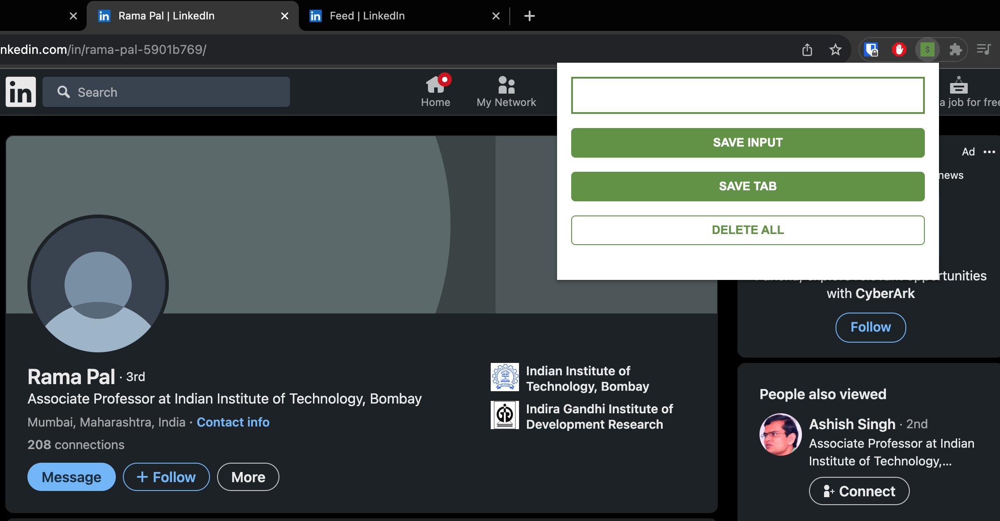

Experience a revolutionary way to manage and track your leads directly from your browser. Our Lead Tracker Chrome Extension offers a streamlined solution for capturing, storing, and organizing essential website URLs. 

## Features

- **Effortless Lead Capture:** With just a click, save URLs of potential leads for future reference.
- **Intuitive User Interface:** Easily manage your saved leads through a clean and user-friendly interface.
- **Instant Access:** Retrieve your saved leads anytime, right from the extension.
- **Quick Deletion:** Remove unwanted leads with a simple double-click.

## UI Demo
- Save Tab 

- Save Input (URL) 

  
- View Leads List

  
- Delete All

## How It Works

1. Download and install the Chrome extension.
2. Click the "Save Tab" button to instantly capture the current tab's URL.
3. Manage your leads by viewing, adding, or deleting them within the extension.
4. Enjoy seamless browsing and lead tracking all in one place.

## Installation

1. Clone this repository to your local machine.
2. Open Chrome and go to `chrome://extensions/`.
3. Enable "Developer mode" and click "Load unpacked."
4. Select the cloned directory to install the extension.

## Usage

- Click the "Save Tab" button to store the current tab's URL as a lead.
- View and manage your leads by clicking the extension icon in your browser toolbar.

## Technologies Used

- HTML/CSS for the user interface.
- JavaScript to handle extension functionality.
- Local storage for data persistence.

## About the Developer

This project showcases my skills in JavaScript and web development. As a passionate developer, I strive to create tools that enhance productivity and efficiency. Feel free to explore the code and contribute to further improvements.

Experience the future of lead tracking with the Lead Tracker Chrome Extension. Simplify your lead management process and take control of your browsing journey.

Ready to get started? Download the extension and organize your leads like never before!
